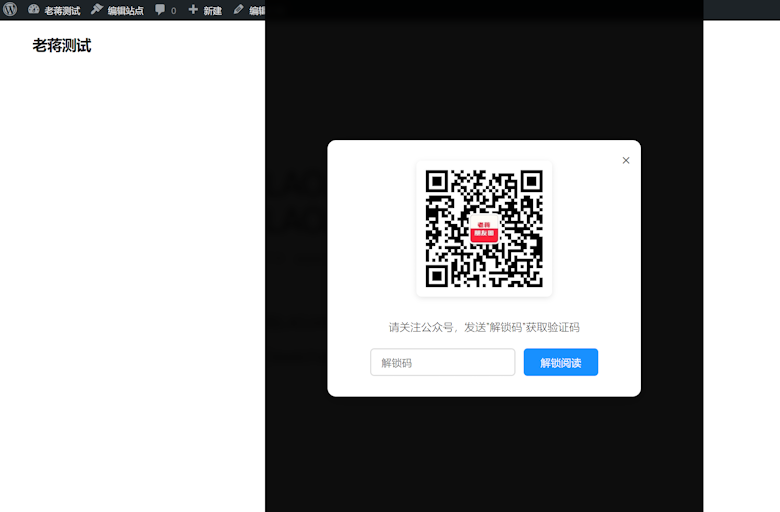
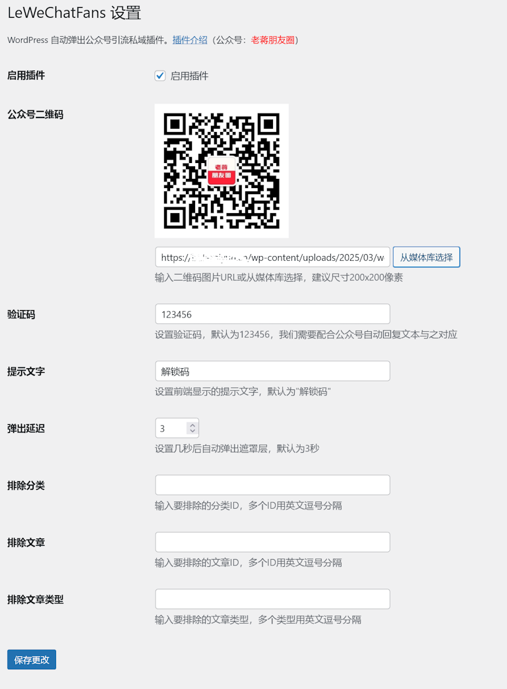

# LeWeChatFans - 一款定时弹出公众号引流涨粉插件

随着自媒体的发展，我们网友从单一的网站端获取知识的时代已经在逐渐的改变。现在已经分散到微博微信或者是其他自媒体端，所以对于我们运营网站用户和企业来讲，需要通过多渠道的聚合用户转化成私域流量。于是，通过网站的流动用户转换到公众号的私域流量还是迫切需要的。

我们一般的做法是通过在文章中或者侧边栏中插入公众号二维码来让用户主动扫码加入公众号联络我们。但是这样的转化率效果太差，于是我们要主动出击。比如，我们通过隐藏内容，必须要关注公众号验证激活才可以看到隐藏的内容。或者是在这篇文章中提到的 [LeWeChatFans](https://www.laojiang.me/6185.html) 插件，也是[老蒋](https://www.laojiang.me/)近期分享的可以设置定时在内容中弹出阻挡用户访问页面，然后要求激活验证关注公众号才可以继续访问。

如上图，我们设置定时访问插件开启之后，在访问文章的时候，就会定时弹出，即便关闭遮罩弹出也会继续弹出，这就是要求用户关注公众号。

插件安装之后，我们就可以在插件后台设置。

- 二维码：我们上传自己的公众号二维码
- 验证码：这个验证码需要匹配公众号自动回复的验证码，确保可以激活。
- 提示文字：这个是用来确定和自动回复的关键字一致。
- 弹出延迟：默认3秒，可以根据需要设置。
- 排除内容：可以根据需要排除分类、文章、类型ID

**插件下载地址**：[https://www.laojiang.me/6185.html](https://www.laojiang.me/6185.html)

**插件作者**：[老蒋](https://www.laojiang.me/)

**插件支持**：[乐在云工作室](https://www.lezaiyun.com/)

